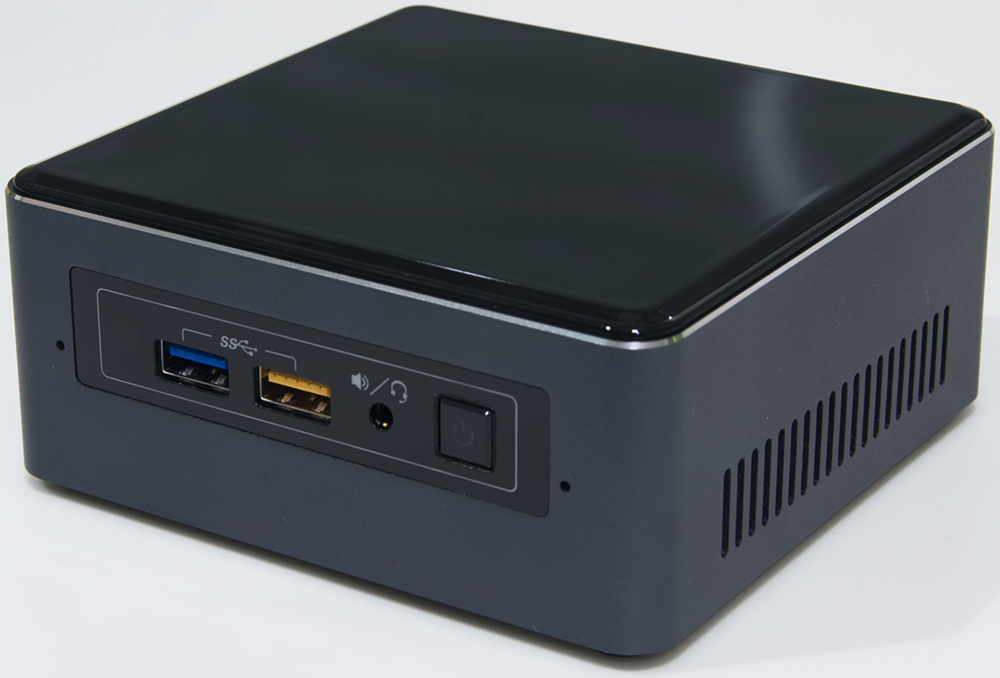
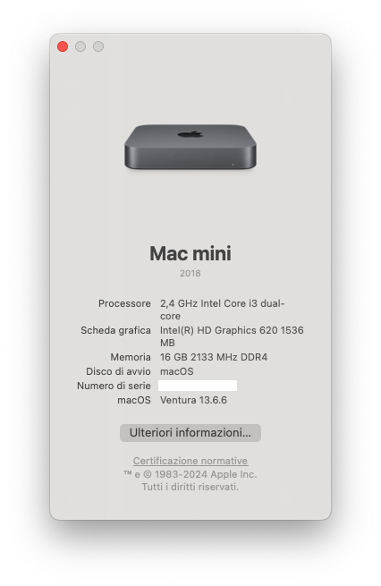
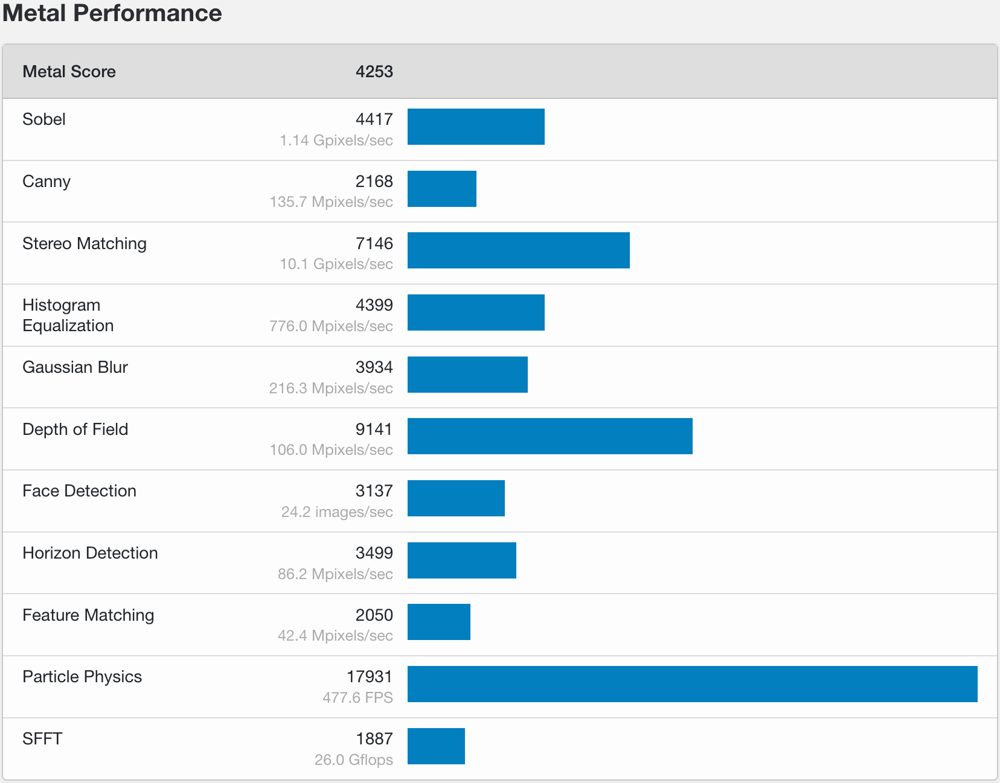
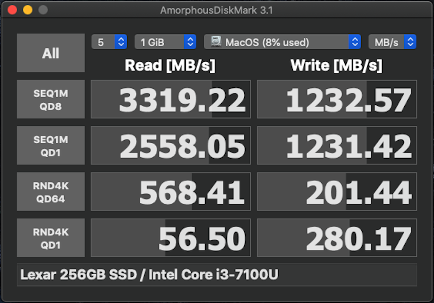
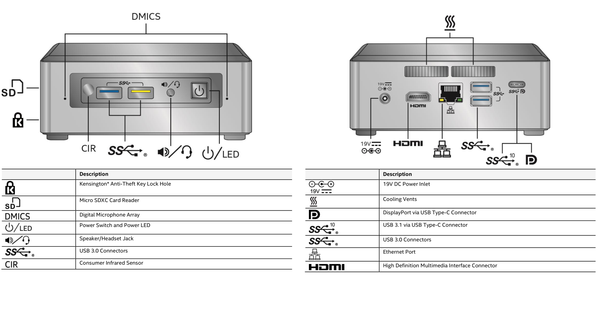

# macOS  on Intel NUC7i3BNH
<p align="center">

</p>
<p align="center">
<a href="https://downloadcenter.intel.com/it/product/95066/Kit-Intel-NUC-NUC7i3BNH" target="_blank"></a>
<a href="LICENSE" target="_blank"></a>
<a href="https://github.com/profzei/NUC7i3BNH/releases" target="_blank"></a>
<a href="https://github.com/profzei/NUC7i3BNH/wiki" target="_blank"></a>
</p>


#### This repo is currently compatible with macOS Catalina and OpenCore 0.6.7

This repo contains information for getting macOS working on an **Intel NUC7i3BNH**.

This EFI is built and tested on **Catalina 10.15.7**: for the moment I stick with Catalina (Supplemental + Security Update - Build 19H524) since I need a machine as stable and reliable as possible as a daily driver. However Big Sur compatibility should be fine (but untested).

**This repository is for personal purposes**

<p align="center">

</p>

### DISCLAIMER

- Read the entire README before you start.
- I am not responsible for any damages you may cause.
- Should you find an error or improve anything — whether in the config or in the documentation — please consider opening an issue or pull request.
- **Complete EFI packs** are available in the [**Releases**](https://github.com/profzei/NUC7i3BNH/releases) page (please, refer to the rightside menu).
- Please **do not clone or download** the main branch for daily use: it may include **unstable code** just because it is my repository.

If you find this bootloader configuration useful, consider **giving** it **a star** to make it more visible.

If you find my work useful, please consider **donating via PayPal**. [](https://www.paypal.com/cgi-bin/webscr?cmd=_donations&business=TSJHK3C2BSQN6&currency_code=EUR)

## Overview

What is an **Intel NUC**? It is a tiny barebone PC size of a few CD cases piled on top of each other.

Mine is **NUC7i3BNH** which is the Core i3 model with a 2.5'' slot for an additional SATA drive coupled with a **BenQ PD2500Q** which is a **2k 25" calibrated monitor**.

### Specifications

| NUC Components       | Details                                                         |
| :--- | :--- |
| Computer model       | Intel NUC7i3BNH                                                 |
| Processor            | Intel Core i3-7100U Processor @ 2.4 GHz dual core with 15 W TDP |
| Memory               | 16 GB DDR4-2133 SO-DIMM @ 1.2 V                                 |
| M.2 SSD Card         | Lexar Professional NM700 PCIe NVMe 256 GB [LNM700-25RB]         |
| SATA SSD 2.5" Drive  | Crucial M500 240 GB [CT240M500SSD1]                             |
| Integrated Graphics  | Intel(R) HD Graphics 620 GPU                                    |
| Sound Card           | Realtek ALC283                                                  |
| LAN Adapter          | Intel Gigabit Ethernet I219 V4
| Wireless Card        | Intel Wireless-AC 8265 (802.11ac, dual-band, max. 867 Mbps)     |
| Bluetooth Card       | Intel Bluetooth 8265 (v. 4.2)                                   |
| **Other Components** |  |
| Monitor              | BenQ PD2500Q 2k Display @ 2560 x 1440 (25" @ 16:9)              |
| Keyboard             | HP Keyboard K1500                                               |
| Mouse                | Microsoft Basic Optical Mouse 2.0                               |

Other hardware specifications:
- Four USB 3.0 ports (2 on the front, 2 on the rear)
- One USB type-C Port (which offers USB 3.1 gen2) with DisplayPort 1.2 functionality
- One normal full-size HDMI 2.0a port
- Micro SD card reader (support SDXC cards and UHS-I)
- Dual-array microphones on the front panel
- Infrared sensor and 3.5 mm audio jack

**Note**: NUC7i3BNH (i.e. the i3 model for NUC7) does not support ThunderBolt over the Type-C connector, unlike the more expensive models in the lineup.

**Device Firmware** BIOS version: `BNKBL357`

<details>
<summary><strong>Benchmarks</strong></summary>

|   |  |
|:---:|:---:|
| **GPU** - **OpenCL** Performance **4514** | **GPU** - **Metal** Performance **4253** |

<p align="center">

</p>

</details>

## BIOS Settings

 Update to the [latest BIOS version](https://downloadcenter.intel.com/it/product/95066/Kit-Intel-NUC-NUC7i3BNH), then load BIOS **Defaults** and finally in the **Advanced** submenu change the following settings:
- `Devices -> USB -> Port Device Charging Mode: Off`
- `Devices -> USB -> USB Legacy -> Disabled`
- `Security -> Thunderbolt Security Level: Legacy Mode`
- `Power -> Wake on LAN from S4/S5: Stay Off`
- `Boot -> Boot Configuration -> Network Boot: Disable`
- `Boot -> Secure Boot -> Disable`

### Generate your own SMBIOS Information

For privacy reasons, all SMBIOS information has been wiped out in the configuration file `EFI/OC/config.plist`.
- You need to generate your unique `SMBIOS` info by yourself (recommend to use [**CorpNewt's GenSMBIOS**](https://github.com/corpnewt/GenSMBIOS)), and inject them into your `config.plist`.

**For dual-booting systems, Windows Activation may fail due to different hardware UUID generated by OpenCore**
- According to [OpenCore Official Configuration](https://github.com/acidanthera/OpenCorePkg/blob/master/Docs/Configuration.pdf), you are highly recommended to inject the **original Windows system UUID** to `PlatformInfo -> Generic - >SystemUUID` in `EFI/OC/config.plist`: run `wmic csproduct get UUID` command in Windows PowerShell app

## Changelog

#### 2021 - April - 09
See [**Current status**](Changelog.md)

## Status
WIP...

## USB Port Mapping on NUC chassis

<p align="center">

</p>

The **active and working USB ports are listed** in the following table, while **all unused or non-referenced USB ports are accordingly removed**.
(WIP: Secondary XHCI + all ports are defined in `USBPorts.kext`)

| USB 2.0 Port Name | USB 3.0 Port Name | Hardware Location       | Controller     |
| ----------------- | ----------------- | ----------------------- | -------------- |
| HS01              | SS01              | Front RIGHT socket      | Primary XHCI   |
| HS02              | SS02              | Front LEFT socket       | Primary XHCI   |
| HS03              | SS03              | Rear BOTTOM socket      | Primary XHCI   |
| HS04              | SS04              | Rear TOP socket         | Primary XHCI   |
| HS08              | n/a               | Internal Bluetooth port | Primary XHCI   |
| HS01              | SS01              | Rear USB-C socket       | Secondary XHCI |

## Optional Settings
<details>  
<summary><strong>Increase Launchpad icons number</strong></summary>

By default, the **Launchpad** shows the icons in 5×7 format (i.e. rows x columns).

Since BenQ PD2500Q is a 2k 25'' monitor, type in **Terminal** the following commands:
```
defaults write com.apple.dock springboard-rows -int 7
defaults write com.apple.dock springboard-columns -int 10;killall Dock
```
Relaunch the Launchpad to see the icons are changed now.

Finally you can revert to the default setting with the following commands:
```
defaults delete com.apple.dock springboard-rows
defaults delete com.apple.dock springboard-columns
defaults write com.apple.dock ResetLaunchPad -bool TRUE;killall Dock
```
(**Warning**: the last command also will remove any custom folders you have created)
</details>

<details>  
<summary><strong>Dual Booting: fix Windows time</strong></summary>

Windows uses local time by default while macOS uses universal time. You can switch Windows 
to use universal time.
Open up a command prompt in Windows as an administrator and copy and paste this in:
```
reg add "HKEY_LOCAL_MACHINE\System\CurrentControlSet\Control\TimeZoneInformation" /v RealTimeIsUniversal /d 1 /t REG_QWORD /f
```
That will make Windows use universal time instead of local time.
Then update your clock via the built-in internet time setting to update the time.
</details>

## Update tracker

| Item | Version | Remark |
| :--- | :--- | :--- |
| MacOS | 10.5.7 | |
| [OpenCore](https://github.com/acidanthera/OpenCorePkg/releases) | 0.6.7 | Default Bootloader|
| [Lilu](https://github.com/acidanthera/Lilu/releases) | 1.5.2 | Kext/process/framework/library patcher |
| [WhateverGreen](https://github.com/acidanthera/whatevergreen/releases) | 1.4.9 | Handle Graphics card |
| [AppleALC](https://github.com/acidanthera/AppleALC/releases) | 1.5.9 | Handle/fix onboard audio |
| [CPUFriend](https://github.com/acidanthera/CPUFriend/releases) | 1.2.3 | Power management |
| [HibernationFixup](https://github.com/acidanthera/HibernationFixup/releases) | 1.4.0 | Handle hibernate status |
| [IntelBluetoothFirmware](https://github.com/OpenIntelWireless/IntelBluetoothFirmware/releases) | 1.1.2 | Handle Bluetooth |
| [AirportItlwm](https://github.com/OpenIntelWireless/itlwm/releases) | 1.3.0 beta | Handle native Wi-Fi card |
| [IntelMausi](https://github.com/acidanthera/IntelMausi/releases) | 1.0.5 | Handle native Ethernet LAN card |
| [NVMeFix](https://github.com/acidanthera/NVMeFix/releases) | 1.0.6 | Fix for NVMe SSDs |
| [RestrictEvents](https://github.com/acidanthera/RestrictEvents/releases) | 1.0.0 | Block unwanted processes |
| [VirtualSMC + plugins](https://github.com/acidanthera/VirtualSMC/releases) | 1.2.2 | SMC chip emulation |
| [USBInjectAll](https://github.com/daliansky/OS-X-USB-Inject-All/releases) | 0.7.7 | Inject USB ports |
| [VoltageShift](https://github.com/sicreative/VoltageShift) | 1.25 | Undervoltage tool |

## Credits
Standing on the shoulders of giants! Based on the works of many great people.
- [Acidanthera](https://github.com/acidanthera)
- [Dortania's OC guide](https://dortania.github.io/OpenCore-Install-Guide/)
- [Rehabman's ACPI hotpatching guide](https://www.tonymacx86.com/threads/guide-using-clover-to-hotpatch-acpi.200137/)
- [CorpNewt's tools](https://github.com/corpnewt)
- [OpenWireless project](https://github.com/OpenIntelWireless/itlwm)
- [Daliansky's OC-little repo](https://github.com/daliansky/OC-little)
- [Khronokernel's DarwinDumped repo](https://github.com/khronokernel/DarwinDumped)

And to everyone else who supports and uses my repo.